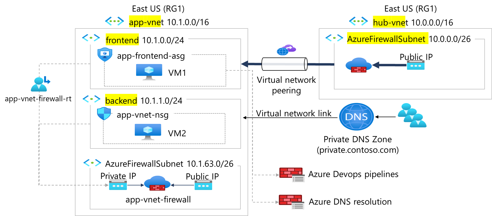

# Lab 01 – Virtual Network Peering (Hub and Spoke)

## Overview
This lab creates two virtual networks in a hub-and-spoke design, includes their subnets, then connects the two virtual networks with VNet peering.
It simulates a real-world pattern where a centralised hub VNet hosts shared services (e.g. a firewall), and spoke VNets host application workloads.

## Architecture


> **Note:** Deployed to UK South rather than East US as shown — 
> region selection has no impact on VNet topology or peering behaviour.

## Resources Deployed

| Resource | Name | Address Space |
|---|---|---|
| Resource Group | AZ-104_Lab | — |
| Spoke VNet | app-vnet | 10.1.0.0/16 |
| Subnet | frontend | 10.1.0.0/24 |
| Subnet | backend | 10.1.1.0/24 |
| Hub VNet | hub-vnet | 10.0.0.0/16 |
| Subnet | AzureFirewallSubnet | 10.0.0.0/26 |
| Peering | app-vnet-to-hub / hub-to-app-vnet | — |

## Key Concepts Demonstrated

- **Hub and spoke topology** — a common enterprise pattern where shared 
  infrastructure lives in a hub VNet and workloads sit in isolated spokes
- **VNet peering** — privately connects two VNets within Azure without 
  traffic leaving the Microsoft backbone
- **Subnet segmentation** — separating frontend and backend tiers within 
  a VNet as a basic security boundary
- **AzureFirewallSubnet** — Azure Firewall requires a dedicated /26 subnet 
  named exactly this — a constraint worth knowing

## Infrastructure as Code
The ARM template for this deployment is included in this folder. To redeploy:
```bash
az group create --name AZ-104_Lab --location eastus
az deployment group create \
  --resource-group AZ-104_Lab \
  --template-file template.json \
  --parameters @parameters.json
```

## Lab Source
[Microsoft Learn – Configure secure access to workloads with Azure virtual networking services]
https://microsoftlearning.github.io/Configure-secure-access-to-workloads-with-Azure-virtual-networking-services/Instructions/Labs/LAB_01_virtual_networks.html
