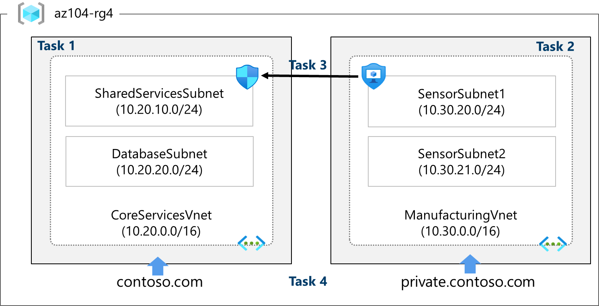

# Lab 04 – Implement Virtual Networking

## Overview
This lab covers the foundational components of Azure virtual networking across four tasks: 
creating VNets via the portal and ARM template, configuring Network Security Groups (NSGs) 
and Application Security Groups (ASGs), and setting up both public and private Azure DNS zones.

It introduces a two-VNet topology representing a core services network and a manufacturing 
network, laying the groundwork for a realistic enterprise network architecture.

> **Note:** Deployed to UK South rather than East US as shown in the lab. Region selection 
> has no impact on the topology, security rules, or DNS behaviour demonstrated.

## Architecture



## Resources Deployed

### Virtual Networks and Subnets

| Resource | Name | Address Space |
|---|---|---|
| Resource Group | az104-rg4 | — |
| Core VNet | CoreServicesVnet | 10.20.0.0/16 |
| Subnet | SharedServicesSubnet | 10.20.10.0/24 |
| Subnet | DatabaseSubnet | 10.20.20.0/24 |
| Manufacturing VNet | ManufacturingVnet | 10.30.0.0/16 |
| Subnet | SensorSubnet1 | 10.30.20.0/24 |
| Subnet | SensorSubnet2 | 10.30.21.0/24 |

### Security Resources

| Resource | Name | Notes |
|---|---|---|
| Application Security Group | asg-web | Groups web-facing VMs logically |
| Network Security Group | myNSGSecure | Associated with SharedServicesSubnet |
| NSG Inbound Rule | AllowASG | Allows TCP 80/443 from asg-web, priority 100 |
| NSG Outbound Rule | DenyInternetOutbound | Denies all internet egress, priority 4096 |

### DNS Zones

| Resource | Name | Type |
|---|---|---|
| DNS Zone | snakeontherun.com | Public |
| A Record | www.snakeontherun.com | Points to 10.1.1.4 |
| Private DNS Zone | private.snakeontherun.com | Private |
| VNet Link | manufacturing-link | Linked to ManufacturingVnet |
| A Record | sensorvm.private.snakeontherun.com | Points to 10.1.1.4 |

---

## Key Concepts Demonstrated

### Portal vs ARM Template deployment
Task 1 creates CoreServicesVnet manually through the portal. Task 2 exports that template, 
edits it for the ManufacturingVnet values, and redeploys via **Deploy a custom template**. 
This highlights a real-world workflow: build once in the portal, extract as code, reuse and 
adapt. The exported template files are included in this folder.

### Non-overlapping address spaces
CoreServicesVnet uses 10.20.0.0/16 and ManufacturingVnet uses 10.30.0.0/16. Overlapping 
address spaces cause routing failures and complicate troubleshooting, a common production 
gotcha when multiple teams independently provision VNets without a central IP addressing scheme.

### Application Security Groups vs Network Security Groups
These serve different purposes and are used together:

- **ASGs** group virtual machines logically by role (e.g. web servers) without relying on 
  IP addresses. When VMs scale or move, the ASG membership handles the rest.
- **NSGs** contain the actual allow/deny rules and can reference ASGs as sources or 
  destinations rather than hardcoded IPs.

The inbound rule `AllowASG` permits TCP 80/443 from `asg-web` — meaning any VM added to 
that ASG automatically inherits the rule without any NSG changes.

### NSG default rules and override behaviour
Azure NSGs include non-deletable default rules. The outbound `AllowInternetOutBound` rule 
at priority 65001 allows all internet egress by default. The `DenyInternetOutbound` rule 
at priority 4096 overrides it. Lower priority numbers always wins, so 4096 takes precedence over 
65001, blocking outbound internet traffic from the subnet.

### Public vs Private DNS Zones

| | Public DNS | Private DNS |
|---|---|---|
| Accessible from | Internet | Linked VNets only |
| Use case | Resolving public domain names | Internal VM name resolution |
| Name server records | Assigned by Azure | Not applicable |
| VNet link required | No | Yes |

The private zone `private.snakeontherun.com` is linked to ManufacturingVnet via `manufacturing-link`, 
meaning only resources inside that VNet can resolve `sensorvm.private.snakeontherun.com`. This is 
the standard pattern for internal service discovery without exposing DNS records publicly.

---

## Infrastructure as Code

CoreServicesVnet was created via the portal and exported as an ARM template. ManufacturingVnet 
was created by modifying that template, demonstrating a realistic IaC workflow.

To redeploy the CoreServicesVnet:

```bash
az group create --name az104-rg4 --location uksouth

az deployment group create \
  --resource-group az104-rg4 \
  --template-file template.json \
  --parameters @parameters.json
```

To convert the ARM template to Bicep for a cleaner, more readable format:

```bash
az bicep decompile --file template.json
```

---

## Cleanup

To avoid ongoing costs, delete the resource group when the lab is complete:

```bash
az group delete --name az104-rg4 --yes --no-wait
```

---

## Lab Source
[AZ-104 Lab 04 – Implement Virtual Networking](https://microsoftlearning.github.io/AZ-104-MicrosoftAzureAdministrator/Instructions/Labs/LAB_04-Implement_Virtual_Networking.html)
